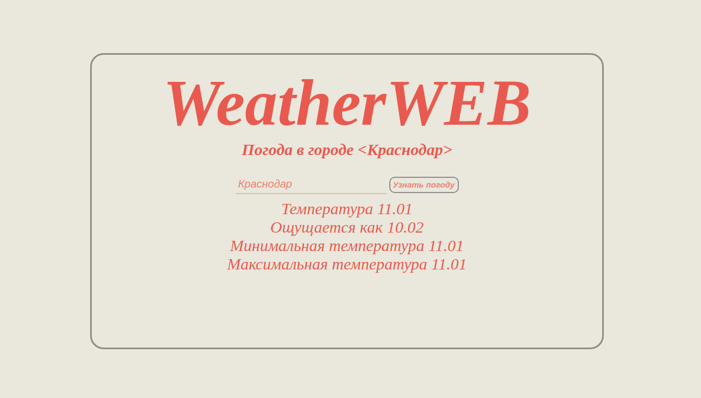

# Проект weatherWeb

## стек Vue JS HTML CSS с подключением погодного API

### здесь реализован одностраничный сайт с возможностью просмотра погоды в своем городе по запросу.

_Для запуска клонируй себе проект на свой ПК после обнови пакет VITE (ЭТО МОЖНО СДЕЛАТЬ В ТЕРМИНАЛЕ ЧЕРЕЗ КОМАНДУ **mpm i vite**) и потом для запусти проект в локал хосте через терменал командой **npm run dev** и пользуйся_

  

